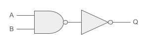
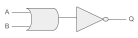
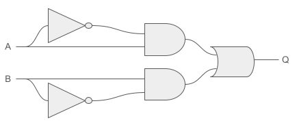

=====
Logic
=====

The goal is to build all `logic gates <https://en.wikipedia.org/wiki/logic>`_ exclusively with a combination of NAND gate(s).
It is called: **Univeral logic gates**.

Charles Sanders Peirce (during 1880–1881) showed that NOR gates alone (or alternatively NAND gates alone) can be used to reproduce the functions of all the other logic gates, but his work on it was unpublished until 1933. The first published proof was by Henry M. Sheffer in 1913, so the NAND logical operation is sometimes called `Sheffer stroke <https://en.wikipedia.org/wiki/Sheffer_stroke>`_

By convention:
 + The inputs will be referenced by a letter starting from A.
 + The output will be referenced by the letter Q.

Basic Gates
===========

.. list-table::
   :widths: 20 20 60
   :header-rows: 1

   * - Gate
     - Truth table
     - Distinctive shape (IEEE Std 91/91a-1991)
   * - NOT
     - +---+---+
       | A | Q |
       +===+===+
       | 0 | 1 |
       +---+---+
       | 1 | 0 |
       +---+---+
     - .. image:: ../images/not.png
             :width: 300
             :align: center
   * - OR
     - +---+---+---+
       | A | B | Q |
       +===+===+===+
       | 0 | 0 | 0 |
       +---+---+---+
       | 0 | 1 | 1 |
       +---+---+---+
       | 1 | 0 | 1 |
       +---+---+---+
       | 1 | 1 | 1 |
       +---+---+---+
     - .. image:: ../images/or.png
             :width: 300
             :align: center
   * - AND
     - +---+---+---+
       | A | B | Q |
       +===+===+===+
       | 0 | 0 | 0 |
       +---+---+---+
       | 0 | 1 | 0 |
       +---+---+---+
       | 1 | 0 | 0 |
       +---+---+---+
       | 1 | 1 | 1 |
       +---+---+---+
     - .. image:: ../images/and.png
             :width: 300
             :align: center
   * - NOR
     - +---+---+---+
       | A | B | Q |
       +===+===+===+
       | 0 | 0 | 1 |
       +---+---+---+
       | 0 | 1 | 0 |
       +---+---+---+
       | 1 | 0 | 0 |
       +---+---+---+
       | 1 | 1 | 0 |
       +---+---+---+
     - .. image:: ../images/nor.png
             :width: 300
             :align: center
   * - NAND
     - +---+---+---+
       | A | B | Q |
       +===+===+===+
       | 0 | 0 | 1 |
       +---+---+---+
       | 0 | 1 | 1 |
       +---+---+---+
       | 1 | 0 | 1 |
       +---+---+---+
       | 1 | 1 | 0 |
       +---+---+---+
     - .. image:: ../images/nand.png
             :width: 300
             :align: center
   * - XOR
     - +---+---+---+
       | A | B | Q |
       +===+===+===+
       | 0 | 0 | 0 |
       +---+---+---+
       | 0 | 1 | 1 |
       +---+---+---+
       | 1 | 0 | 1 |
       +---+---+---+
       | 1 | 1 | 0 |
       +---+---+---+
     - .. image:: ../images/xor.png
             :width: 300
             :align: center
   * - XNOR
     - +---+---+---+
       | A | B | Q |
       +===+===+===+
       | 0 | 0 | 1 |
       +---+---+---+
       | 0 | 1 | 0 |
       +---+---+---+
       | 1 | 0 | 0 |
       +---+---+---+
       | 1 | 1 | 1 |
       +---+---+---+
     - .. image:: ../images/xnor.png
             :width: 300
             :align: center

Constructed Gates
=================

.. warning::

   All following logic gates must be implemented based on the NAND gate. We can also use other logic gates, either if they are exclusively constructed using the NAND gate or if they are constructed using other gates which, in turn, are built with the NAND gate, and so forth.

NOT
---

.. image:: ../images/not_construction.png
        :width: 300
        :align: center

.. literalinclude:: ../../src/logic/not.h
   :language: c
   :emphasize-lines: 12
   :linenos:

OR
--

.. image:: ../images/or_construction.png
        :width: 300
        :align: center

.. literalinclude:: ../../src/logic/or.h
   :language: c
   :emphasize-lines: 13
   :linenos:

AND
---

.. literalinclude:: ../../src/logic/and.h
   :language: c
   :emphasize-lines: 13
   :linenos:

NOR
---

.. literalinclude:: ../../src/logic/nor.h
   :language: c
   :emphasize-lines: 12
   :linenos:

XOR
---

.. literalinclude:: ../../src/logic/xor.h
   :language: c
   :emphasize-lines: 14-15
   :linenos:

XNOR
----

.. image:: ../images/xnor_construction.png
        :width: 300
        :align: center

.. literalinclude:: ../../src/logic/xnor.h
   :language: c
   :emphasize-lines: 13
   :linenos:
